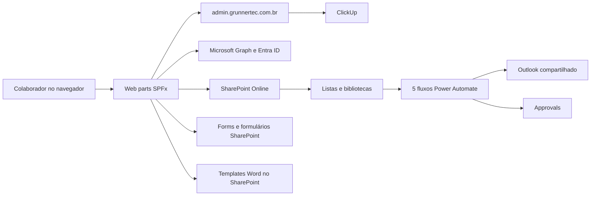

# Arquitetura

## Visão geral

A Intranet Grunner é uma solução cliente construída com SharePoint Framework. Ela é executada no navegador dentro do SharePoint Online e utiliza a identidade Microsoft 365 do usuário. O repositório analisado não contém backend próprio.

## Componentes implantáveis

| Web part | Identificador | Responsabilidade |
|---|---|---|
| `HomeGrunnerWebPart` | `6a418d3b-a153-479f-ada1-c113ff679dfe` | Home, notícias, engajamento, celebrações, eventos e chamados |
| `PoliticasGrunnerWebPart` | `076d85df-9a04-4af6-97cc-35cf923c58d2` | Políticas, SGQ, revisão, aprovação e documentos |
| `HistoriaGrunnerWebPart` | `c138e08d-5b9f-42de-a59d-f283c5ef84b4` | História institucional |
| `CentralAtalhosGrunnerWebPart` | `ea7d911e-2241-4676-a37f-e4f14c58d75e` | Links úteis e solicitações |
| `PainelAtivosGrunnerWebPart` | `008ad6e2-11b0-4604-9327-097db2c16440` | Inventário, transferências, termos e acessos de ativos |

Todos declaram suporte a SharePoint Web Part, Teams Personal App, Teams Tab e SharePoint Full Page. O uso efetivo em cada host precisa ser confirmado pelo responsável do ambiente.

## Camadas

### Apresentação

- React 17
- Fluent UI 8
- Sass
- Componentes de página concentrados em `src/webparts/*/components`

### Acesso a dados

- `SPHttpClient` para REST do SharePoint
- PnPjs no módulo de ativos
- `MSGraphClientV3` para Microsoft Graph
- `fetch` para o serviço administrativo de chamados

O módulo de ativos possui um serviço separado em `SharePointService.ts`. Os demais módulos misturam interface, regra e acesso a dados nos componentes React. Essa diferença deve orientar a refatoração futura.

### Dados e documentos

- Listas SharePoint para conteúdo, acessos, interação e ativos
- Bibliotecas SharePoint para políticas, rascunhos e templates
- Cinco automações Power Automate para notícias, resumo, vencimentos, rascunhos e aprovação documental
- Histórico de versões do SharePoint para políticas e ativos
- Word gerado no navegador com Docxtemplater e PizZip
- Excel gerado no navegador com SheetJS

## Fluxos principais

### Home

1. Identifica o usuário logado.
2. Verifica acesso de Marketing e Qualidade.
3. Consulta notícias e eventos no SharePoint.
4. Consulta celebrações no Microsoft Graph.
5. Consulta chamados no serviço externo.
6. Carrega curtidas e comentários.

### Documento do SGQ

1. Usuário escolhe o tipo de documento.
2. Formulário baixa um template Word do SharePoint.
3. O navegador preenche o template.
4. O arquivo é enviado para `RascunhosSGQ`.
5. Metadados e aprovadores são gerenciados na tela da Qualidade.
6. O documento aprovado segue o processo operacional definido pela Qualidade.

O passo 6 não está totalmente comprovado no repositório e deve ser validado com a área de Qualidade.

### Ativos

1. Usuário é classificado como TI, visualizador ou colaborador.
2. Ativos são consultados na lista `Ativos de TI`.
3. TI pode cadastrar, editar e transferir itens.
4. O sistema gera códigos sequenciais por tipo.
5. Termos Word podem ser gerados no navegador.
6. O histórico usa o versionamento da lista.

## Decisões e riscos arquiteturais

- A plataforma Microsoft 365 reduz infraestrutura própria e centraliza identidade.
- O código depende de nomes e caminhos fixos do tenant.
- O backend dos chamados é um sistema separado e precisa de documentação própria.
- Componentes grandes aumentam custo de manutenção e teste.
- Alterar um nome interno de coluna SharePoint pode quebrar o sistema sem erro de compilação.
- O build de produção atual falha e deve ser corrigido antes de uma liberação.

## Evolução recomendada

1. Criar serviços separados para Home, políticas e chamados.
2. Remover endereços e e-mails individuais do código e centralizar configuração.
3. Versionar o provisionamento de listas, bibliotecas, colunas e grupos.
4. Adicionar testes de unidade e contrato.
5. Adicionar telemetria e correlação de erros.
6. Documentar e testar recuperação do ambiente.
